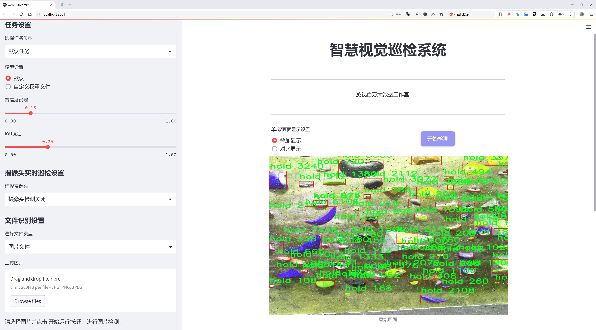

# 攀岩握点检测系统源码分享
 # [一条龙教学YOLOV8标注好的数据集一键训练_70+全套改进创新点发刊_Web前端展示]

### 1.研究背景与意义

项目参考[AAAI Association for the Advancement of Artificial Intelligence](https://gitee.com/qunmasj/projects)

项目来源[AACV Association for the Advancement of Computer Vision](https://kdocs.cn/l/cszuIiCKVNis)

研究背景与意义

随着攀岩运动的普及和发展，攀岩技术的提升对攀岩者的训练和比赛表现产生了重要影响。在攀岩过程中，握点的选择和使用直接关系到攀岩者的成功与否。因此，如何准确、快速地识别和分析攀岩握点，成为了攀岩训练和比赛中的一个关键问题。传统的握点识别方法依赖于教练的经验和攀岩者的个人感觉，存在主观性强、效率低下等问题，难以满足现代攀岩训练的需求。基于此，开发一种高效、准确的攀岩握点检测系统显得尤为重要。

近年来，深度学习技术的迅猛发展为物体检测领域带来了新的机遇。YOLO（You Only Look Once）系列模型因其高效的实时检测能力和良好的检测精度，逐渐成为物体检测任务中的主流选择。YOLOv8作为该系列的最新版本，结合了更先进的网络结构和训练策略，展现出更强的性能。然而，YOLOv8在特定应用场景下仍存在一些不足之处，尤其是在复杂背景和多类物体的检测任务中。因此，针对攀岩握点的特定需求，对YOLOv8进行改进，构建一个专门的攀岩握点检测系统，具有重要的研究价值和实际意义。

本研究将基于改进的YOLOv8模型，开发一个攀岩握点检测系统，利用“Climbing Replica Test”数据集进行训练和测试。该数据集包含3100张图像，涵盖11类攀岩握点，包括crimp、edge、foothold、jug、pinch、pocket、sloper、volume等多种握点类型。这些类别的多样性为模型的训练提供了丰富的样本，有助于提高系统的泛化能力和准确性。通过对不同握点的特征进行深入分析和学习，系统能够实现对攀岩握点的自动识别和分类，为攀岩者提供实时的技术支持。

此外，改进YOLOv8模型的过程将涉及对网络结构的优化、数据增强技术的应用以及模型训练策略的调整。这不仅能够提升模型在攀岩握点检测中的性能，也为深度学习在其他运动分析领域的应用提供了借鉴和参考。通过构建这一系统，研究将为攀岩训练提供科学依据，帮助攀岩者更好地理解和掌握握点使用技巧，从而提升其整体表现。

综上所述，基于改进YOLOv8的攀岩握点检测系统的研究，不仅具有重要的理论意义，还将为实际攀岩训练和比赛提供有效的技术支持。通过这一研究，期望能够推动攀岩运动的科学化、系统化发展，为广大的攀岩爱好者和专业运动员提供更为精准的训练指导和数据支持。

### 2.图片演示





##### 注意：由于此博客编辑较早，上面“2.图片演示”和“3.视频演示”展示的系统图片或者视频可能为老版本，新版本在老版本的基础上升级如下：（实际效果以升级的新版本为准）

  （1）适配了YOLOV8的“目标检测”模型和“实例分割”模型，通过加载相应的权重（.pt）文件即可自适应加载模型。

  （2）支持“图片识别”、“视频识别”、“摄像头实时识别”三种识别模式。

  （3）支持“图片识别”、“视频识别”、“摄像头实时识别”三种识别结果保存导出，解决手动导出（容易卡顿出现爆内存）存在的问题，识别完自动保存结果并导出到tempDir中。

  （4）支持Web前端系统中的标题、背景图等自定义修改，后面提供修改教程。

  另外本项目提供训练的数据集和训练教程,暂不提供权重文件（best.pt）,需要您按照教程进行训练后实现图片演示和Web前端界面演示的效果。

### 3.视频演示

[3.1 视频演示](https://www.bilibili.com/video/BV1JQ2TY5ELs/)

### 4.数据集信息展示

##### 4.1 本项目数据集详细数据（类别数＆类别名）

nc: 1
names: ['hold']


##### 4.2 本项目数据集信息介绍

数据集信息展示

在本研究中，我们采用了名为“Climbing Replica Test”的数据集，以训练和改进YOLOv8模型在攀岩握点检测系统中的应用。该数据集专注于攀岩运动中的握点识别，旨在提高模型在实际攀岩环境中的准确性和鲁棒性。通过对攀岩握点的精确检测，系统能够为攀岩者提供更为有效的支持，进而提升其攀爬表现和安全性。

“Climbing Replica Test”数据集的类别数量为1，主要包含“hold”这一类别。该类别代表了攀岩过程中使用的各种握点，涵盖了不同形状、大小和材质的握点特征。这一单一类别的设计使得数据集在攀岩握点检测的专注性上具有明显优势，能够帮助模型更好地学习和识别攀岩握点的多样性。由于攀岩握点的形态各异，模型需要通过大量的样本数据进行训练，以捕捉握点的细微差别和变化，从而实现高效的检测。

数据集中的图像样本均经过精心挑选，确保涵盖了不同环境和光照条件下的攀岩握点。这些样本不仅包括了室内攀岩馆的握点，还涉及到户外自然岩壁的握点，体现了攀岩运动的多样性和复杂性。每张图像都配有详细的标注信息，标注包括握点的位置信息和类别标签，为模型的训练提供了丰富的监督信号。通过这样的标注方式，YOLOv8模型能够在训练过程中逐步学习到握点的特征，从而在实际应用中实现更高的检测精度。

此外，数据集的构建还考虑到了攀岩握点的多样性与代表性，确保所选握点能够覆盖不同的攀岩风格和技术要求。这种多样性不仅有助于模型的泛化能力提升，也为攀岩者在不同环境下的训练和比赛提供了更为全面的支持。随着模型在“Climbing Replica Test”数据集上的训练不断深入，我们期望能够显著提高YOLOv8在攀岩握点检测任务中的表现，使其能够在复杂的攀岩场景中快速、准确地识别握点。

总之，“Climbing Replica Test”数据集为攀岩握点检测系统的研究提供了坚实的基础，通过对单一类别“hold”的深入学习，模型将能够更好地适应实际攀岩环境的需求。未来的研究将继续利用这一数据集，探索更多的改进方法，以进一步提升YOLOv8在攀岩握点检测中的应用效果。通过不断的优化和调整，我们期待能够为攀岩者提供更为智能化的辅助工具，助力他们在攀岩运动中取得更好的成绩。


### 5.全套项目环境部署视频教程（零基础手把手教学）

[5.1 环境部署教程链接（零基础手把手教学）](https://www.ixigua.com/7404473917358506534?logTag=c807d0cbc21c0ef59de5)


[5.2 安装Python虚拟环境创建和依赖库安装视频教程链接（零基础手把手教学）](https://www.ixigua.com/7404474678003106304?logTag=1f1041108cd1f708b01a)

### 6.手把手YOLOV8训练视频教程（零基础小白有手就能学会）

[6.1 手把手YOLOV8训练视频教程（零基础小白有手就能学会）](https://www.ixigua.com/7404477157818401292?logTag=d31a2dfd1983c9668658)


按照上面的训练视频教程链接加载项目提供的数据集，运行train.py即可开始训练



     Epoch   gpu_mem       box       obj       cls    labels  img_size
     1/200     20.8G   0.01576   0.01955  0.007536        22      1280: 100%|██████████| 849/849 [14:42<00:00,  1.04s/it]
               Class     Images     Labels          P          R     mAP@.5 mAP@.5:.95: 100%|██████████| 213/213 [01:14<00:00,  2.87it/s]
                 all       3395      17314      0.994      0.957      0.0957      0.0843

     Epoch   gpu_mem       box       obj       cls    labels  img_size
     2/200     20.8G   0.01578   0.01923  0.007006        22      1280: 100%|██████████| 849/849 [14:44<00:00,  1.04s/it]
               Class     Images     Labels          P          R     mAP@.5 mAP@.5:.95: 100%|██████████| 213/213 [01:12<00:00,  2.95it/s]
                 all       3395      17314      0.996      0.956      0.0957      0.0845

     Epoch   gpu_mem       box       obj       cls    labels  img_size
     3/200     20.8G   0.01561    0.0191  0.006895        27      1280: 100%|██████████| 849/849 [10:56<00:00,  1.29it/s]
               Class     Images     Labels          P          R     mAP@.5 mAP@.5:.95: 100%|███████   | 187/213 [00:52<00:00,  4.04it/s]
                 all       3395      17314      0.996      0.957      0.0957      0.0845


### 7.70+种全套YOLOV8创新点代码加载调参视频教程（一键加载写好的改进模型的配置文件）

[7.1 70+种全套YOLOV8创新点代码加载调参视频教程（一键加载写好的改进模型的配置文件）](https://www.ixigua.com/7404478314661806627?logTag=29066f8288e3f4eea3a4)

### 8.70+种全套YOLOV8创新点原理讲解（非科班也可以轻松写刊发刊，V10版本正在科研待更新）

#### 由于篇幅限制，每个创新点的具体原理讲解就不一一展开，具体见下列网址中的创新点对应子项目的技术原理博客网址【Blog】：


[8.1 70+种全套YOLOV8创新点原理讲解链接](https://gitee.com/qunmasj/good)

#### 部分改进原理讲解(完整的改进原理见上图和技术博客链接)【如果此小节的图加载失败可以通过CSDN或者Github搜索该博客的标题访问原始博客，原始博客图片显示正常】
### YOLOv8简介
YOLO（You Only Look Once）是一种流行的对象检测和图像分割模型，由华盛顿大学的Joseph Redmon和Ali Farhadi开发。YOLO于2015年推出，以其高速度和高精度迅速走红。

YOLOv2于2016年发布，通过合并批处理规范化、锚盒和维度集群来改进原始模型
2018年推出的YOLOv3使用更高效的骨干网络、多个锚点和空间金字塔池进一步增强了该模型的性能
YOLOv4于2020年发布，引入了Mosaic数据增强、新的无锚检测头和新的丢失功能等创新
YOLOv5进一步提高了模型的性能，并添加了超参数优化、集成实验跟踪和自动导出到流行导出格式等新功能
YOLOv6于2022年由美团开源，目前正在该公司的许多自动配送机器人中使用
YOLOv7在COCO关键点数据集上添加了额外的任务，如姿态估计
YOLOv8是Ultralytics公司推出的YOLO的最新版本。作为一款尖端、最先进的（SOTA）车型，YOLOv8在之前版本的成功基础上，引入了新的功能和改进，以增强性能、灵活性和效率。YOLOv8支持全方位的视觉AI任务，包括检测、分割、姿态估计、跟踪和分类。这种多功能性允许用户在不同的应用程序和域中利用YOLOv8的功能
#### YOLOv8的新特性与可用模型

Ultralytics 并没有直接将开源库命名为 YOLOv8，而是直接使用 ultralytics 这个词，原因是 ultralytics 将这个库定位为算法框架，而非某一个特定算法，一个主要特点是可扩展性。其希望这个库不仅仅能够用于 YOLO 系列模型，而是能够支持非 YOLO 模型以及分类分割姿态估计等各类任务。总而言之，ultralytics 开源库的两个主要优点是：

融合众多当前 SOTA 技术于一体
未来将支持其他 YOLO 系列以及 YOLO 之外的更多算法
Ultralytics为YOLO模型发布了一个全新的存储库。它被构建为 用于训练对象检测、实例分割和图像分类模型的统一框架。

提供了一个全新的 SOTA 模型，包括 P5 640 和 P6 1280 分辨率的目标检测网络和基于 YOLACT 的实例分割模型。和 YOLOv5 一样，基于缩放系数也提供了 N/S/M/L/X 尺度的不同大小模型，用于满足不同场景需求
骨干网络和 Neck 部分可能参考了 YOLOv7 ELAN 设计思想，将 YOLOv5 的 C3 结构换成了梯度流更丰富的 C2f 结构，并对不同尺度模型调整了不同的通道数，属于对模型结构精心微调，不再是无脑一套参数应用所有模型，大幅提升了模型性能。不过这个 C2f 模块中存在 Split 等操作对特定硬件部署没有之前那么友好了
Head 部分相比 YOLOv5 改动较大，换成了目前主流的解耦头结构，将分类和检测头分离，同时也从 Anchor-Based 换成了 Anchor-Free
Loss 计算方面采用了 TaskAlignedAssigner 正样本分配策略，并引入了 Distribution Focal Loss
训练的数据增强部分引入了 YOLOX 中的最后 10 epoch 关闭 Mosiac 增强的操作，可以有效地提升精度
YOLOv8 还高效灵活地支持多种导出格式，并且该模型可以在 CPU 和 GPU 上运行。YOLOv8 模型的每个类别中有五个模型用于检测、分割和分类。YOLOv8 Nano 是最快和最小的，而 YOLOv8 Extra Large (YOLOv8x) 是其中最准确但最慢的。


### FocalModulation模型的基本原理
参考该博客，Focal Modulation Networks（FocalNets）的基本原理是替换自注意力（Self-Attention）模块，使用焦点调制（focal modulation）机制来捕捉图像中的长距离依赖和上下文信息。下图是自注意力和焦点调制两种方法的对比。


自注意力要求对每个查询令牌（Query Token）与其他令牌进行复杂的查询-键（Query-Key）交互和查询-值（Query-Value）聚合，以计算注意力分数并捕捉上下文。而焦点调制则先将空间上下文以不同粒度聚合到调制器中，然后以查询依赖的方式将这些调制器注入到查询令牌中。焦点调制简化了交互和聚合操作，使其更轻量级。在图中，自注意力部分使用红色虚线表示查询-键交互和黄色虚线表示查询-值聚合，而焦点调制部分则用蓝色表示调制器聚合和黄色表示查询-调制器交互。 

FocalModulation模型通过以下步骤实现：

1. 焦点上下文化：用深度卷积层堆叠来编码不同范围的视觉上下文。


2. 门控聚合：通过门控机制，选择性地将上下文信息聚合到每个查询令牌的调制器中。


3. 逐元素仿射变换：将聚合后的调制器通过仿射变换注入到每个查询令牌中。

下面来分别介绍这三个机制->

#### 焦点上下文化
焦点上下文化（Focal Contextualization）是焦点调制（Focal Modulation）的一个组成部分。焦点上下文化使用一系列深度卷积层（depth-wise convolutional layers）来编码不同范围内的视觉上下文信息。这些层可以捕捉从近处到远处的视觉特征，从而允许网络在不同层次上理解图像内容。通过这种方式，网络能够在聚合上下文信息时保持对局部细节的敏感性，并增强对全局结构的认识。


​

这张图详细比较了自注意力（Self-Attention, SA）和焦点调制（Focal Modulation）的机制，并特别展示了焦点调制中的上下文聚合过程。左侧的图展示了自注意力模型如何通过键（k）和查询（q）之间的交互，以及随后的聚合来生成输出。而中间和右侧的图说明了焦点调制如何通过层级化的上下文聚合和门控聚合过程替代自注意力模型的这一过程。在焦点调制中，输入首先通过轻量级线性层进行处理，然后通过层级化的上下文化模块和门控机制来选择性地聚合信息，最终通过调制器与查询（q）进行交互以生成输出。

#### 门控聚合
在Focal Modulation Networks（FocalNets）中的 "门控聚合"（Gated Aggregation）是关键组件之一，这一过程涉及使用门控机制来选择性地聚合上下文信息。以下是这个过程的详细分析：

1. 什么是门控机制？
门控机制在深度学习中常用于控制信息流。它通常用于决定哪些信息应该被传递，哪些应该被阻断。在循环神经网络（RNN）中，特别是在长短期记忆网络（LSTM）和门控循环单元（GRU）中，门控机制用于调节信息在时间序列数据中的流动。

2. 门控聚合的目的
在FocalNets中，门控聚合的目的是为每个查询令牌（即处理中的数据单元）选择性地聚合上下文信息。这意味着网络能够决定哪些特定的上下文信息对于当前处理的查询令牌是重要的，从而专注于那些最相关的信息。

3. 如何实现门控聚合？
实现门控聚合可能涉及一系列计算步骤，其中包括：

计算上下文信息：这可能涉及使用深度卷积层（如文中提到的）对输入图像的不同区域进行编码，以捕捉从局部到全局的视觉上下文。
门控操作：这一步骤涉及到一个决策过程，根据当前查询令牌的特征来决定哪些上下文信息是相关的。这可能通过一个学习到的权重（门）来实现，该权重决定了不同上下文信息的重要性。
信息聚合：最后，根据门控操作的结果，选择性地聚合上下文信息到一个调制器中。这个调制器随后被用于调整或“调制”查询令牌的表示。
4. 门控聚合的好处
通过门控聚合，FocalNets能够更有效地聚焦于对当前任务最关键的信息。这种方法提高了模型的效率和性能，因为它减少了不必要信息的处理，同时增强了对关键特征的关注。在视觉任务中，这可能意味着更好的目标检测和图像分类性能，特别是在复杂或多变的视觉环境中。

总结：门控聚合是FocalNets的一个核心组成部分，它通过选择性地集中处理重要的上下文信息来提升网络的效率和性能。

#### 逐元素仿射变换
在Focal Modulation Networks（FocalNets）中的第三个关键组件是逐元素仿射变换，这个步骤涉及将通过门控聚合得到的调制器注入到每个查询令牌中。以下是该过程的详细分析：

1. 仿射变换的基本概念：
仿射变换是一种线性变换，用于对数据进行缩放、旋转、平移和倾斜等操作。在深度学习中，逐元素的仿射变换通常指的是对每个元素进行线性变换，这种变换可以被描述为y = ax + b，其中x是输入，y是输出，a和b是变换的参数。

2. 逐元素仿射变换的作用：
在FocalNets中，逐元素仿射变换的作用是将聚合后的调制器信息注入到每个查询令牌中。这个步骤对于整合上下文信息和查询令牌的原始特征非常重要。通过这种方式，调制器所包含的上下文信息可以直接影响查询令牌的表示。

3. 执行仿射变换：
执行这一步骤时，聚合后的调制器对每个查询令牌进行逐元素的仿射变换。在实践中，这可能意味着对查询令牌的每个特征应用调制器中的相应权重（a）和偏差（b）。这样，调制器中的每个元素都直接对应于查询令牌的一个特征，通过调整这些特征来改变其表达。

4. 仿射变换的效果：
通过逐元素仿射变换，模型能够更细致地调整每个查询令牌的特征，根据上下文信息来增强或抑制某些特征。这种精细的调整机制允许网络更好地适应复杂的视觉场景，提高对细节的捕捉能力，从而提升了模型在各种视觉任务中的性能，如目标检测和图像分类。

总结：逐元素仿射变换它使得模型能够利用上下文信息来有效地调整查询令牌，增强了模型对关键视觉特征的捕捉和表达能力。


### 9.系统功能展示（检测对象为举例，实际内容以本项目数据集为准）

图9.1.系统支持检测结果表格显示

  图9.2.系统支持置信度和IOU阈值手动调节

  图9.3.系统支持自定义加载权重文件best.pt(需要你通过步骤5中训练获得)

  图9.4.系统支持摄像头实时识别

  图9.5.系统支持图片识别

  图9.6.系统支持视频识别

  图9.7.系统支持识别结果文件自动保存

  图9.8.系统支持Excel导出检测结果数据


### 10.原始YOLOV8算法原理

原始YOLOv8算法原理

YOLOv8算法是由Glenn-Jocher提出的最新版本，继承了YOLO系列的优良传统，尤其是YOLOv3和YOLOv5的设计理念，结合了最新的技术进展和研究成果。YOLOv8的设计旨在提升目标检测的精度和速度，同时保持算法的易用性和灵活性，使其在各种应用场景中表现出色。

在数据预处理方面，YOLOv8延续了YOLOv5的策略，采用了多种数据增强技术以提高模型的泛化能力。具体而言，YOLOv8使用了马赛克增强、混合增强、空间扰动和颜色扰动等四种增强手段。这些技术通过对训练数据进行多样化处理，使得模型能够更好地适应不同的输入条件，从而提高检测精度。马赛克增强特别有效，它通过将多张图像拼接成一张新图像，迫使模型学习到更复杂的背景和物体组合，提高了模型对不同场景的适应能力。

YOLOv8的骨干网络结构在YOLOv5的基础上进行了重要改进。YOLOv5的主干网络采用了C3模块，该模块通过引入分流的思想，增强了特征提取的能力。而在YOLOv8中，C3模块被更为先进的C2f模块所替代。C2f模块通过增加更多的分支，丰富了梯度回传时的支流，使得模型在特征学习时能够获得更丰富的信息。这种设计不仅提高了特征表示能力，还在一定程度上减轻了模型的计算负担。

在特征融合方面，YOLOv8依然采用了FPN（特征金字塔网络）和PAN（路径聚合网络）的结构。这种结构能够有效地融合多尺度信息，使得模型在处理不同大小的目标时，能够保持较高的检测精度。YOLOv8对FPN-PAN结构的改进主要体现在将C3模块替换为C2f模块，从而在保持原有优势的基础上，进一步提升了特征融合的效果。

YOLOv8在检测头的设计上也进行了显著的改进。传统的YOLO系列算法使用耦合头（Coupled Head），即通过一层卷积同时完成分类和定位任务。而YOLOv8则采用了解耦头（Decoupled Head）结构，将分类和定位任务分开处理。通过两个并行的分支，YOLOv8能够分别提取类别特征和位置特征，从而提高了模型的灵活性和准确性。这种解耦设计使得模型在处理复杂场景时，能够更好地聚焦于不同的任务，提高了整体性能。

在标签分配策略方面，YOLOv8引入了动态标签分配策略，取代了YOLOv5中基于候选框的静态分配方法。YOLOv8采用了TOOD策略，通过对目标框和目标分数的动态调整，实现了更为灵活的正负样本匹配。这种方法使得模型在训练过程中能够更好地适应数据集的分布特征，减少了由于数据集不足而导致的聚类误差。此外，YOLOv8的损失函数设计也经过了优化，分类损失采用了VFL Loss（Varifocal Loss），而回归损失则结合了CIoULoss和DFLLoss。这种损失函数的设计使得模型在训练时能够更有效地聚焦于高质量的正样本，从而提升了检测精度。

YOLOv8的网络结构可以分为输入端、骨干网络、颈部网络和头部网络四个部分。输入端采用640x640的默认图像尺寸，并通过自适应缩放和马赛克增强等技术提高模型的训练和推理效率。骨干网络部分则通过C2f模块的引入，增强了特征提取的能力。颈部网络通过FPN-PAN结构加强了多尺度特征的融合，而头部网络则通过解耦设计和无锚框检测方法，进一步提升了模型的检测性能。

总的来说，YOLOv8算法在多个方面进行了创新和改进，尤其是在特征提取、特征融合、检测头设计和标签分配策略等方面。这些改进使得YOLOv8在目标检测任务中表现出色，能够在保持高精度的同时，实现快速的推理速度。随着YOLOv8的推出，目标检测技术在实际应用中的潜力得到了进一步释放，为各类计算机视觉任务提供了强有力的支持。


### 11.项目核心源码讲解（再也不用担心看不懂代码逻辑）

#### 11.1 ui.py

以下是代码的核心部分，并附上详细的中文注释：

```python
import sys
import subprocess

def run_script(script_path):
    """
    使用当前 Python 环境运行指定的脚本。

    Args:
        script_path (str): 要运行的脚本路径

    Returns:
        None
    """
    # 获取当前 Python 解释器的路径
    python_path = sys.executable

    # 构建运行命令，使用 streamlit 运行指定的脚本
    command = f'"{python_path}" -m streamlit run "{script_path}"'

    # 执行命令
    result = subprocess.run(command, shell=True)
    # 检查命令执行结果，如果返回码不为0，表示执行出错
    if result.returncode != 0:
        print("脚本运行出错。")

# 实例化并运行应用
if __name__ == "__main__":
    # 指定要运行的脚本路径
    script_path = "web.py"  # 这里假设脚本在当前目录下

    # 调用函数运行脚本
    run_script(script_path)
```

### 代码分析与注释：
1. **导入模块**：
   - `sys`：用于访问与 Python 解释器相关的变量和函数。
   - `subprocess`：用于创建新进程、连接到它们的输入/输出/错误管道，并获得返回码。

2. **`run_script` 函数**：
   - 该函数接收一个脚本路径作为参数，并在当前 Python 环境中运行该脚本。
   - 使用 `sys.executable` 获取当前 Python 解释器的路径，以确保脚本在正确的环境中运行。
   - 构建命令字符串，使用 `streamlit` 模块运行指定的脚本。
   - 使用 `subprocess.run` 执行命令，并通过 `shell=True` 允许在 shell 中执行命令。
   - 检查命令的返回码，如果不为0，则输出错误信息。

3. **主程序块**：
   - 通过 `if __name__ == "__main__":` 确保只有在直接运行该脚本时才会执行以下代码。
   - 指定要运行的脚本路径，这里假设脚本名为 `web.py`。
   - 调用 `run_script` 函数，传入脚本路径以执行该脚本。

这段代码的核心功能是运行一个指定的 Python 脚本，并确保在当前的 Python 环境中执行。

这个程序文件 `ui.py` 的主要功能是运行一个指定的 Python 脚本，具体来说是通过 Streamlit 框架来启动一个 Web 应用。代码的结构相对简单，主要由几个部分组成。

首先，文件导入了必要的模块，包括 `sys`、`os` 和 `subprocess`。`sys` 模块用于访问与 Python 解释器相关的变量和函数，`os` 模块提供了与操作系统交互的功能，而 `subprocess` 模块则用于创建新进程、连接到它们的输入/输出/错误管道，并获取它们的返回码。

接下来，代码中定义了一个名为 `run_script` 的函数，该函数接受一个参数 `script_path`，表示要运行的脚本的路径。在函数内部，首先获取当前 Python 解释器的路径，这通过 `sys.executable` 实现。然后，构建一个命令字符串，该命令使用当前的 Python 解释器和 Streamlit 模块来运行指定的脚本。具体的命令格式为 `"{python_path}" -m streamlit run "{script_path}"`。

随后，使用 `subprocess.run` 方法执行这个命令，`shell=True` 参数表示在 shell 中执行命令。执行后，函数检查返回码，如果返回码不为零，表示脚本运行出错，则打印一条错误信息。

最后，在文件的主程序部分，通过 `if __name__ == "__main__":` 判断当前模块是否是主程序。如果是，则指定要运行的脚本路径，这里使用了 `abs_path("web.py")`，这个函数可能是用来获取 `web.py` 文件的绝对路径。然后调用 `run_script` 函数来运行这个脚本。

总体来说，这个程序的功能是通过 Streamlit 框架启动一个 Web 应用，具体的应用逻辑则在 `web.py` 文件中实现。

#### 11.2 70+种YOLOv8算法改进源码大全和调试加载训练教程（非必要）\ultralytics\trackers\byte_tracker.py

以下是经过简化和注释的核心代码部分，主要集中在 `STrack` 类和 `BYTETracker` 类的核心功能上：

```python
import numpy as np
from .basetrack import BaseTrack, TrackState
from .utils import matching
from .utils.kalman_filter import KalmanFilterXYAH

class STrack(BaseTrack):
    """
    单目标跟踪表示，使用卡尔曼滤波进行状态估计。
    """

    shared_kalman = KalmanFilterXYAH()  # 共享的卡尔曼滤波器实例

    def __init__(self, tlwh, score, cls):
        """初始化 STrack 实例。"""
        # 将输入的边界框转换为 tlwh 格式并存储
        self._tlwh = np.asarray(self.tlbr_to_tlwh(tlwh[:-1]), dtype=np.float32)
        self.kalman_filter = None  # 当前对象的卡尔曼滤波器
        self.mean, self.covariance = None, None  # 状态均值和协方差
        self.is_activated = False  # 是否激活的标志

        self.score = score  # 置信度分数
        self.tracklet_len = 0  # 跟踪长度
        self.cls = cls  # 类别标签
        self.idx = tlwh[-1]  # 对象索引

    def predict(self):
        """使用卡尔曼滤波器预测对象的下一个状态。"""
        mean_state = self.mean.copy()  # 复制当前均值状态
        if self.state != TrackState.Tracked:
            mean_state[7] = 0  # 如果状态不是跟踪状态，设置速度为0
        self.mean, self.covariance = self.kalman_filter.predict(mean_state, self.covariance)  # 预测下一个状态

    def activate(self, kalman_filter, frame_id):
        """激活新的跟踪器。"""
        self.kalman_filter = kalman_filter  # 设置卡尔曼滤波器
        self.track_id = self.next_id()  # 获取下一个跟踪ID
        self.mean, self.covariance = self.kalman_filter.initiate(self.convert_coords(self._tlwh))  # 初始化状态

        self.tracklet_len = 0  # 重置跟踪长度
        self.state = TrackState.Tracked  # 设置状态为跟踪
        if frame_id == 1:
            self.is_activated = True  # 第一个帧激活
        self.frame_id = frame_id  # 当前帧ID
        self.start_frame = frame_id  # 开始帧ID

class BYTETracker:
    """
    BYTETracker: 基于 YOLOv8 的对象检测和跟踪算法。
    """

    def __init__(self, args, frame_rate=30):
        """初始化跟踪器。"""
        self.tracked_stracks = []  # 成功激活的跟踪列表
        self.lost_stracks = []  # 丢失的跟踪列表
        self.removed_stracks = []  # 移除的跟踪列表

        self.frame_id = 0  # 当前帧ID
        self.args = args  # 命令行参数
        self.max_time_lost = int(frame_rate / 30.0 * args.track_buffer)  # 最大丢失时间
        self.kalman_filter = self.get_kalmanfilter()  # 获取卡尔曼滤波器
        self.reset_id()  # 重置ID

    def update(self, results, img=None):
        """使用新检测更新对象跟踪器。"""
        self.frame_id += 1  # 增加帧ID
        activated_stracks = []  # 激活的跟踪列表
        refind_stracks = []  # 重新找到的跟踪列表
        lost_stracks = []  # 丢失的跟踪列表
        removed_stracks = []  # 移除的跟踪列表

        scores = results.conf  # 检测分数
        bboxes = results.xyxy  # 检测边界框
        bboxes = np.concatenate([bboxes, np.arange(len(bboxes)).reshape(-1, 1)], axis=-1)  # 添加索引
        cls = results.cls  # 类别

        # 根据分数筛选检测
        remain_inds = scores > self.args.track_high_thresh
        dets = bboxes[remain_inds]  # 高分检测
        scores_keep = scores[remain_inds]  # 高分检测的分数
        cls_keep = cls[remain_inds]  # 高分检测的类别

        # 初始化跟踪
        detections = self.init_track(dets, scores_keep, cls_keep, img)
        # 处理已跟踪的对象
        unconfirmed = [track for track in self.tracked_stracks if not track.is_activated]
        tracked_stracks = [track for track in self.tracked_stracks if track.is_activated]

        # 预测当前状态
        strack_pool = self.joint_stracks(tracked_stracks, self.lost_stracks)
        self.multi_predict(strack_pool)

        # 计算距离并进行匹配
        dists = self.get_dists(strack_pool, detections)
        matches, u_track, u_detection = matching.linear_assignment(dists, thresh=self.args.match_thresh)

        # 更新匹配的跟踪
        for itracked, idet in matches:
            track = strack_pool[itracked]
            det = detections[idet]
            track.update(det, self.frame_id)  # 更新跟踪状态
            activated_stracks.append(track)

        # 处理未确认的跟踪
        for it in u_track:
            track = strack_pool[it]
            track.mark_lost()  # 标记为丢失
            lost_stracks.append(track)

        # 初始化新的跟踪
        for inew in u_detection:
            track = detections[inew]
            if track.score < self.args.new_track_thresh:
                continue
            track.activate(self.kalman_filter, self.frame_id)  # 激活新的跟踪
            activated_stracks.append(track)

        # 更新状态
        self.tracked_stracks = [t for t in self.tracked_stracks if t.state == TrackState.Tracked]
        self.tracked_stracks = self.joint_stracks(self.tracked_stracks, activated_stracks)
        self.lost_stracks.extend(lost_stracks)

        return np.asarray(
            [x.tlbr.tolist() + [x.track_id, x.score, x.cls, x.idx] for x in self.tracked_stracks if x.is_activated],
            dtype=np.float32)  # 返回激活的跟踪结果
```

### 代码注释说明：
1. **STrack 类**：负责单个对象的跟踪，使用卡尔曼滤波器进行状态预测和更新。包含初始化、预测、激活、更新等方法。
2. **BYTETracker 类**：负责管理多个对象的跟踪，处理检测结果，进行状态更新和匹配，维护跟踪状态（如激活、丢失、移除等）。
3. **核心方法**：
   - `predict()`：预测下一个状态。
   - `activate()`：激活新的跟踪。
   - `update()`：更新已匹配的跟踪状态。
   - `multi_predict()`：对多个跟踪进行预测。
   - `get_dists()`：计算跟踪与检测之间的距离。

该程序文件实现了一个基于YOLOv8的目标跟踪算法，主要包括两个类：`STrack`和`BYTETracker`。`STrack`类用于表示单个目标的跟踪状态，使用卡尔曼滤波器进行状态估计。该类包含了跟踪对象的所有信息，包括位置、置信度、类别等，并提供了预测、更新和转换坐标等方法。

在`STrack`类中，`shared_kalman`是一个共享的卡尔曼滤波器实例，用于所有`STrack`对象的状态预测。类的构造函数接收目标的边界框信息、置信度和类别，并初始化相关属性。`predict`方法用于预测目标的下一个状态，`update`方法用于更新与新检测结果匹配的目标状态，`activate`和`re_activate`方法用于激活新的跟踪或重新激活丢失的跟踪。

`BYTETracker`类则负责管理多个目标的跟踪，维护被跟踪、丢失和移除的目标列表。它的构造函数接收参数并初始化跟踪器的状态。`update`方法是该类的核心，负责接收新的检测结果，进行目标跟踪的更新和状态管理。该方法包括多个步骤，如目标的关联、状态预测、丢失目标的处理以及新目标的初始化。

在更新过程中，`BYTETracker`会使用卡尔曼滤波器预测当前目标的位置，并通过距离计算（如IOU）来进行目标与检测结果的匹配。它还会处理丢失的目标，检查目标是否超出最大丢失时间，并相应地更新目标的状态。最后，`BYTETracker`会返回当前帧中被激活的目标的边界框信息。

总的来说，该程序实现了一个高效的目标跟踪系统，结合了YOLOv8的目标检测能力和卡尔曼滤波的状态估计技术，适用于视频序列中的目标跟踪任务。

#### 11.3 70+种YOLOv8算法改进源码大全和调试加载训练教程（非必要）\ultralytics\hub\utils.py

以下是代码中最核心的部分，并附上详细的中文注释：

```python
import requests
from ultralytics.utils import TQDM, TryExcept, __version__, ENVIRONMENT, SETTINGS, ONLINE

def requests_with_progress(method, url, **kwargs):
    """
    使用指定的方法和URL进行HTTP请求，并可选地显示进度条。

    参数:
        method (str): 要使用的HTTP方法（例如 'GET', 'POST'）。
        url (str): 要发送请求的URL。
        **kwargs (dict): 传递给底层 `requests.request` 函数的其他关键字参数。

    返回:
        (requests.Response): HTTP请求的响应对象。

    注意:
        - 如果 'progress' 设置为 True，进度条将显示已知内容长度的响应的下载进度。
        - 如果 'progress' 是一个数字，则进度条将假设内容长度 = progress。
    """
    progress = kwargs.pop('progress', False)  # 从kwargs中提取进度参数
    if not progress:
        return requests.request(method, url, **kwargs)  # 如果没有进度，直接返回请求结果
    
    # 否则，使用流式请求
    response = requests.request(method, url, stream=True, **kwargs)
    total = int(response.headers.get('content-length', 0) if isinstance(progress, bool) else progress)  # 获取总大小
    try:
        pbar = TQDM(total=total, unit='B', unit_scale=True, unit_divisor=1024)  # 初始化进度条
        for data in response.iter_content(chunk_size=1024):  # 按块读取内容
            pbar.update(len(data))  # 更新进度条
        pbar.close()  # 关闭进度条
    except requests.exceptions.ChunkedEncodingError:  # 处理连接中断的异常
        response.close()  # 关闭响应
    return response  # 返回响应对象


def smart_request(method, url, retry=3, timeout=30, thread=True, verbose=True, progress=False, **kwargs):
    """
    使用'requests'库进行HTTP请求，具有指数退避重试机制，直到达到指定的超时。

    参数:
        method (str): 请求使用的HTTP方法。选择 'post' 或 'get'。
        url (str): 要请求的URL。
        retry (int, optional): 放弃之前尝试的重试次数。默认为3。
        timeout (int, optional): 超时（秒），在此之后函数将放弃重试。默认为30。
        thread (bool, optional): 是否在单独的守护线程中执行请求。默认为True。
        verbose (bool, optional): 一个标志，用于确定是否在控制台打印输出。默认为True。
        progress (bool, optional): 请求期间是否显示进度条。默认为False。
        **kwargs (dict): 传递给指定方法的请求函数的关键字参数。

    返回:
        (requests.Response): HTTP响应对象。如果请求在单独的线程中执行，则返回None。
    """
    retry_codes = (408, 500)  # 仅对这些状态码进行重试

    @TryExcept(verbose=verbose)
    def func(func_method, func_url, **func_kwargs):
        """进行带有重试和超时的HTTP请求，并可选地跟踪进度。"""
        r = None  # 响应
        t0 = time.time()  # 记录初始时间
        for i in range(retry + 1):
            if (time.time() - t0) > timeout:  # 检查是否超时
                break
            r = requests_with_progress(func_method, func_url, **func_kwargs)  # 发起请求
            if r.status_code < 300:  # 如果状态码在2xx范围内，认为请求成功
                break
            # 处理错误信息
            try:
                m = r.json().get('message', 'No JSON message.')
            except AttributeError:
                m = 'Unable to read JSON.'
            if i == 0:  # 仅在第一次请求时输出信息
                if r.status_code in retry_codes:
                    m += f' Retrying {retry}x for {timeout}s.' if retry else ''
                if verbose:
                    LOGGER.warning(f'请求失败: {m} ({r.status_code})')
            time.sleep(2 ** i)  # 指数退避
        return r  # 返回响应

    args = method, url
    kwargs['progress'] = progress  # 将进度参数传递给func
    if thread:
        threading.Thread(target=func, args=args, kwargs=kwargs, daemon=True).start()  # 在新线程中执行
    else:
        return func(*args, **kwargs)  # 直接执行请求
```

### 代码核心部分说明：
1. **requests_with_progress**：该函数用于发起HTTP请求，并在下载过程中显示进度条。它支持流式下载，适用于大文件的下载。
2. **smart_request**：该函数是一个智能请求函数，具有重试机制和超时控制。它可以在请求失败时自动重试，并在达到最大重试次数或超时后停止请求。它还可以选择在新线程中执行请求，以避免阻塞主线程。

这个程序文件是Ultralytics YOLO（You Only Look Once）项目的一部分，主要用于处理与网络请求和事件分析相关的功能。代码中导入了多个模块和库，包括操作系统、平台、随机数、线程、时间、路径处理和HTTP请求库等。以下是对代码的详细讲解。

首先，文件定义了一些常量，包括API的根地址和Web根地址，这些地址可以通过环境变量进行配置。接着，定义了一个函数`request_with_credentials`，该函数用于在Google Colab环境中进行带有身份验证的AJAX请求。如果该函数在非Colab环境中运行，则会抛出一个OSError异常。该函数使用JavaScript代码在浏览器中执行请求，并返回响应数据。

接下来，定义了一个`requests_with_progress`函数，用于执行HTTP请求，并在下载过程中显示进度条。这个函数支持多种HTTP方法（如GET和POST），并且可以通过参数控制是否显示进度条。

然后，定义了一个`smart_request`函数，它封装了HTTP请求的逻辑，并实现了重试机制。该函数支持指定重试次数、超时时间、是否在新线程中执行等参数。如果请求失败，函数会根据响应状态码进行重试，最多重试指定的次数。它还可以在请求过程中显示进度条。

接下来，定义了一个`Events`类，用于收集匿名事件分析数据。该类在初始化时设置了一些默认值，包括事件列表、速率限制、元数据等。它还根据特定条件决定是否启用事件收集。该类的`__call__`方法用于添加新事件到事件列表，并在达到速率限制时发送事件数据。

最后，代码实例化了`Events`类，创建了一个`events`对象，以便在后续的操作中使用。

整体来看，这个文件的主要功能是提供网络请求的封装和事件分析的支持，旨在提高YOLO项目在使用过程中的用户体验和数据收集能力。

#### 11.4 code\ultralytics\trackers\track.py

以下是代码中最核心的部分，并附上详细的中文注释：

```python
# 导入必要的库
from functools import partial
from pathlib import Path
import torch
from ultralytics.utils import IterableSimpleNamespace, yaml_load
from ultralytics.utils.checks import check_yaml
from .bot_sort import BOTSORT
from .byte_tracker import BYTETracker

# 跟踪器类型与对应类的映射
TRACKER_MAP = {"bytetrack": BYTETracker, "botsort": BOTSORT}

def on_predict_start(predictor: object, persist: bool = False) -> None:
    """
    在预测开始时初始化对象跟踪器。

    参数:
        predictor (object): 要为其初始化跟踪器的预测器对象。
        persist (bool, optional): 如果跟踪器已存在，是否保持其状态。默认为 False。

    异常:
        AssertionError: 如果 tracker_type 不是 'bytetrack' 或 'botsort'。
    """
    # 检查任务类型是否为 OBB，若是则抛出异常
    if predictor.args.task == "obb":
        raise NotImplementedError("ERROR ❌ OBB 任务不支持跟踪模式！")
    
    # 如果预测器已有跟踪器且选择保持状态，则直接返回
    if hasattr(predictor, "trackers") and persist:
        return

    # 检查并加载跟踪器的配置文件
    tracker = check_yaml(predictor.args.tracker)
    cfg = IterableSimpleNamespace(**yaml_load(tracker))

    # 确保跟踪器类型是支持的类型
    if cfg.tracker_type not in ["bytetrack", "botsort"]:
        raise AssertionError(f"目前只支持 'bytetrack' 和 'botsort'，但得到了 '{cfg.tracker_type}'")

    # 初始化跟踪器列表
    trackers = []
    for _ in range(predictor.dataset.bs):
        # 根据配置创建相应的跟踪器实例
        tracker = TRACKER_MAP[cfg.tracker_type](args=cfg, frame_rate=30)
        trackers.append(tracker)
    
    # 将创建的跟踪器列表赋值给预测器
    predictor.trackers = trackers

def on_predict_postprocess_end(predictor: object, persist: bool = False) -> None:
    """
    在预测后处理结束时，更新检测到的框并进行对象跟踪。

    参数:
        predictor (object): 包含预测结果的预测器对象。
        persist (bool, optional): 如果跟踪器已存在，是否保持其状态。默认为 False。
    """
    bs = predictor.dataset.bs  # 批次大小
    path, im0s = predictor.batch[:2]  # 获取路径和图像数据

    for i in range(bs):
        # 如果不保持状态且视频路径不同，则重置跟踪器
        if not persist and predictor.vid_path[i] != str(predictor.save_dir / Path(path[i]).name):
            predictor.trackers[i].reset()

        # 获取当前检测结果
        det = predictor.results[i].boxes.cpu().numpy()
        if len(det) == 0:
            continue  # 如果没有检测到目标，则跳过

        # 更新跟踪器并获取跟踪结果
        tracks = predictor.trackers[i].update(det, im0s[i])
        if len(tracks) == 0:
            continue  # 如果没有跟踪到目标，则跳过

        # 更新预测结果，只保留跟踪到的目标
        idx = tracks[:, -1].astype(int)
        predictor.results[i] = predictor.results[i][idx]
        predictor.results[i].update(boxes=torch.as_tensor(tracks[:, :-1]))

def register_tracker(model: object, persist: bool) -> None:
    """
    为模型注册跟踪回调，以便在预测期间进行对象跟踪。

    参数:
        model (object): 要为其注册跟踪回调的模型对象。
        persist (bool): 如果跟踪器已存在，是否保持其状态。
    """
    # 注册预测开始时的回调
    model.add_callback("on_predict_start", partial(on_predict_start, persist=persist))
    # 注册预测后处理结束时的回调
    model.add_callback("on_predict_postprocess_end", partial(on_predict_postprocess_end, persist=persist))
```

### 代码核心部分说明：
1. **跟踪器初始化**：`on_predict_start` 函数用于在预测开始时初始化跟踪器。它检查任务类型和跟踪器配置，并根据配置创建相应的跟踪器实例。
2. **后处理跟踪**：`on_predict_postprocess_end` 函数在预测后处理结束时更新检测框，并通过跟踪器更新目标的跟踪信息。
3. **注册回调**：`register_tracker` 函数用于将跟踪相关的回调函数注册到模型中，以便在预测过程中自动调用。

这个程序文件是用于对象跟踪的，主要是与Ultralytics YOLO模型相关的功能实现。代码的核心是为模型的预测过程添加跟踪器，并在预测后处理阶段更新检测到的对象。

首先，文件导入了一些必要的库和模块，包括`torch`和一些Ultralytics的工具函数。接着，定义了一个跟踪器类型与相应跟踪器类的映射字典`TRACKER_MAP`，目前支持的跟踪器有`BYTETracker`和`BOTSORT`。

`on_predict_start`函数用于在预测开始时初始化跟踪器。它接受一个预测器对象和一个可选的持久化参数。如果任务类型是“obb”，则抛出一个未实现的错误，因为该任务不支持跟踪模式。如果预测器已经有跟踪器并且持久化参数为真，则直接返回。接下来，函数会检查配置文件中的跟踪器类型，如果不是支持的类型，则抛出一个断言错误。然后，函数会为每个批次的样本创建相应的跟踪器实例，并将它们存储在预测器的`trackers`属性中。

`on_predict_postprocess_end`函数在预测后处理结束时被调用，用于更新检测到的框并进行对象跟踪。它首先获取批次大小和图像数据，然后对每个样本进行处理。如果不是持久化且视频路径发生变化，则重置跟踪器。接着，函数获取检测结果，如果没有检测到对象，则跳过该样本。否则，调用跟踪器的`update`方法来更新跟踪信息。如果跟踪结果不为空，则根据跟踪结果更新预测器的结果。

最后，`register_tracker`函数用于将跟踪回调注册到模型中，以便在预测过程中能够调用前面定义的跟踪器初始化和后处理函数。它通过模型的`add_callback`方法将`on_predict_start`和`on_predict_postprocess_end`函数注册为回调，并传递持久化参数。

总体而言，这段代码实现了在YOLO模型的预测过程中对对象进行跟踪的功能，确保在检测到对象后能够持续追踪其位置。

#### 11.5 train.py

以下是代码中最核心的部分，并附上详细的中文注释：

```python
class DetectionTrainer(BaseTrainer):
    """
    扩展自 BaseTrainer 类的检测模型训练类。
    用于训练 YOLO 检测模型。
    """

    def build_dataset(self, img_path, mode="train", batch=None):
        """
        构建 YOLO 数据集。

        参数:
            img_path (str): 包含图像的文件夹路径。
            mode (str): 模式，`train` 或 `val`，用户可以为每种模式自定义不同的增强。
            batch (int, optional): 批次大小，仅用于 `rect` 模式。默认为 None。
        """
        gs = max(int(de_parallel(self.model).stride.max() if self.model else 0), 32)
        return build_yolo_dataset(self.args, img_path, batch, self.data, mode=mode, rect=mode == "val", stride=gs)

    def get_dataloader(self, dataset_path, batch_size=16, rank=0, mode="train"):
        """构造并返回数据加载器。"""
        assert mode in ["train", "val"]  # 确保模式有效
        with torch_distributed_zero_first(rank):  # 在分布式训练中，确保数据集只初始化一次
            dataset = self.build_dataset(dataset_path, mode, batch_size)
        shuffle = mode == "train"  # 训练模式下打乱数据
        if getattr(dataset, "rect", False) and shuffle:
            LOGGER.warning("WARNING ⚠️ 'rect=True' 与 DataLoader shuffle 不兼容，设置 shuffle=False")
            shuffle = False
        workers = self.args.workers if mode == "train" else self.args.workers * 2  # 设置工作线程数
        return build_dataloader(dataset, batch_size, workers, shuffle, rank)  # 返回数据加载器

    def preprocess_batch(self, batch):
        """对一批图像进行预处理，包括缩放和转换为浮点数。"""
        batch["img"] = batch["img"].to(self.device, non_blocking=True).float() / 255  # 将图像转移到设备并归一化
        if self.args.multi_scale:  # 如果启用多尺度
            imgs = batch["img"]
            sz = (
                random.randrange(self.args.imgsz * 0.5, self.args.imgsz * 1.5 + self.stride)
                // self.stride
                * self.stride
            )  # 随机选择新的尺寸
            sf = sz / max(imgs.shape[2:])  # 计算缩放因子
            if sf != 1:
                ns = [
                    math.ceil(x * sf / self.stride) * self.stride for x in imgs.shape[2:]
                ]  # 计算新的形状
                imgs = nn.functional.interpolate(imgs, size=ns, mode="bilinear", align_corners=False)  # 进行插值
            batch["img"] = imgs  # 更新批次图像
        return batch

    def get_model(self, cfg=None, weights=None, verbose=True):
        """返回 YOLO 检测模型。"""
        model = DetectionModel(cfg, nc=self.data["nc"], verbose=verbose and RANK == -1)  # 创建检测模型
        if weights:
            model.load(weights)  # 加载权重
        return model

    def get_validator(self):
        """返回用于 YOLO 模型验证的 DetectionValidator。"""
        self.loss_names = "box_loss", "cls_loss", "dfl_loss"  # 定义损失名称
        return yolo.detect.DetectionValidator(
            self.test_loader, save_dir=self.save_dir, args=copy(self.args), _callbacks=self.callbacks
        )

    def plot_training_samples(self, batch, ni):
        """绘制带有注释的训练样本。"""
        plot_images(
            images=batch["img"],
            batch_idx=batch["batch_idx"],
            cls=batch["cls"].squeeze(-1),
            bboxes=batch["bboxes"],
            paths=batch["im_file"],
            fname=self.save_dir / f"train_batch{ni}.jpg",
            on_plot=self.on_plot,
        )
```

### 代码核心部分说明：
1. **DetectionTrainer 类**：这是一个用于训练 YOLO 检测模型的类，继承自 `BaseTrainer`。
2. **build_dataset 方法**：用于构建 YOLO 数据集，接受图像路径、模式和批次大小作为参数。
3. **get_dataloader 方法**：构造数据加载器，支持训练和验证模式，确保在分布式训练中只初始化一次数据集。
4. **preprocess_batch 方法**：对图像批次进行预处理，包括归一化和多尺度调整。
5. **get_model 方法**：返回一个 YOLO 检测模型，并可选择加载预训练权重。
6. **get_validator 方法**：返回用于模型验证的验证器，记录损失名称。
7. **plot_training_samples 方法**：绘制训练样本及其注释，便于可视化训练过程。

这个程序文件 `train.py` 是一个用于训练 YOLO（You Only Look Once）目标检测模型的 Python 脚本，属于 Ultralytics YOLO 项目的一部分。它主要通过继承 `BaseTrainer` 类来实现训练过程中的各项功能。

在文件开头，导入了一些必要的库和模块，包括数学运算、随机数生成、深度学习相关的 PyTorch 模块，以及 Ultralytics YOLO 项目中的数据处理、模型构建和训练工具等。

`DetectionTrainer` 类是该文件的核心，专门用于构建和训练目标检测模型。类中包含多个方法，每个方法负责不同的功能。

`build_dataset` 方法用于构建 YOLO 数据集。它接收图像路径、模式（训练或验证）和批次大小作为参数，并调用 `build_yolo_dataset` 函数来创建数据集。

`get_dataloader` 方法则负责构建数据加载器。它会根据传入的模式（训练或验证）来初始化数据集，并设置是否打乱数据顺序。对于训练模式，数据会被打乱，而在验证模式下则不会。

`preprocess_batch` 方法用于对每个批次的图像进行预处理，包括将图像缩放到合适的大小并转换为浮点数格式。该方法还支持多尺度训练，即在训练过程中随机选择不同的图像尺寸。

`set_model_attributes` 方法用于设置模型的属性，包括类别数量和类别名称等。它将数据集中的信息附加到模型上，以便在训练过程中使用。

`get_model` 方法用于返回一个 YOLO 检测模型。它可以根据配置文件和权重文件来加载模型。

`get_validator` 方法返回一个用于模型验证的 `DetectionValidator` 实例，负责在训练后对模型进行评估。

`label_loss_items` 方法用于返回一个包含训练损失项的字典，方便在训练过程中进行监控和记录。

`progress_string` 方法返回一个格式化的字符串，显示训练进度，包括当前的 epoch、GPU 内存使用情况、损失值、实例数量和图像大小等信息。

`plot_training_samples` 方法用于绘制训练样本及其标注信息，帮助可视化训练数据的质量。

最后，`plot_metrics` 和 `plot_training_labels` 方法分别用于绘制训练过程中的指标和标签图，帮助用户更好地理解模型的训练效果。

总体而言，这个文件实现了 YOLO 模型训练的主要功能，包括数据集构建、数据加载、图像预处理、模型设置、训练监控和结果可视化等。

#### 11.6 code\ultralytics\solutions\heatmap.py

以下是代码中最核心的部分，并附上详细的中文注释：

```python
import cv2
import numpy as np
from collections import defaultdict
from shapely.geometry import LineString, Point, Polygon

class Heatmap:
    """用于实时视频流中绘制热图的类，基于对象的轨迹进行绘制。"""

    def __init__(self):
        """初始化热图类，设置默认的可视化、图像和热图参数。"""
        # 可视化信息
        self.annotator = None  # 注释器
        self.view_img = False  # 是否显示图像
        self.shape = "circle"  # 热图形状，默认为圆形

        # 图像信息
        self.imw = None  # 图像宽度
        self.imh = None  # 图像高度
        self.im0 = None  # 原始图像
        self.view_in_counts = True  # 是否显示进入计数
        self.view_out_counts = True  # 是否显示离开计数

        # 热图的颜色映射和热图数组
        self.colormap = None  # 热图颜色映射
        self.heatmap = None  # 热图数组
        self.heatmap_alpha = 0.5  # 热图透明度

        # 预测/跟踪信息
        self.boxes = None  # 检测框
        self.track_ids = None  # 跟踪ID
        self.clss = None  # 类别
        self.track_history = defaultdict(list)  # 跟踪历史

        # 区域和线信息
        self.count_reg_pts = None  # 计数区域点
        self.counting_region = None  # 计数区域
        self.line_dist_thresh = 15  # 线计数的距离阈值
        self.region_thickness = 5  # 区域厚度
        self.region_color = (255, 0, 255)  # 区域颜色

        # 对象计数信息
        self.in_counts = 0  # 进入计数
        self.out_counts = 0  # 离开计数
        self.counting_list = []  # 计数列表
        self.count_txt_thickness = 0  # 计数文本厚度
        self.count_txt_color = (0, 0, 0)  # 计数文本颜色
        self.count_color = (255, 255, 255)  # 计数背景颜色

        # 衰减因子
        self.decay_factor = 0.99  # 热图衰减因子

    def set_args(self, imw, imh, colormap=cv2.COLORMAP_JET, heatmap_alpha=0.5, view_img=False,
                 view_in_counts=True, view_out_counts=True, count_reg_pts=None,
                 count_txt_thickness=2, count_txt_color=(0, 0, 0), count_color=(255, 255, 255),
                 count_reg_color=(255, 0, 255), region_thickness=5, line_dist_thresh=15,
                 decay_factor=0.99, shape="circle"):
        """
        配置热图的颜色映射、宽度、高度和显示参数。

        参数:
            imw (int): 帧的宽度。
            imh (int): 帧的高度。
            colormap (cv2.COLORMAP): 要设置的颜色映射。
            heatmap_alpha (float): 热图显示的透明度。
            view_img (bool): 是否显示帧。
            view_in_counts (bool): 是否在视频流中显示进入计数。
            view_out_counts (bool): 是否在视频流中显示离开计数。
            count_reg_pts (list): 对象计数区域的点。
            count_txt_thickness (int): 对象计数显示的文本厚度。
            count_txt_color (RGB color): 计数文本颜色值。
            count_color (RGB color): 计数文本背景颜色值。
            count_reg_color (RGB color): 对象计数区域的颜色。
            region_thickness (int): 对象计数区域的厚度。
            line_dist_thresh (int): 线计数的欧几里得距离阈值。
            decay_factor (float): 对象经过后去除热图区域的值。
            shape (str): 热图形状，支持矩形或圆形。
        """
        self.imw = imw
        self.imh = imh
        self.heatmap_alpha = heatmap_alpha
        self.view_img = view_img
        self.view_in_counts = view_in_counts
        self.view_out_counts = view_out_counts
        self.colormap = colormap

        # 区域和线选择
        if count_reg_pts is not None:
            if len(count_reg_pts) == 2:
                self.count_reg_pts = count_reg_pts
                self.counting_region = LineString(count_reg_pts)  # 线计数器
            elif len(count_reg_pts) == 4:
                self.count_reg_pts = count_reg_pts
                self.counting_region = Polygon(self.count_reg_pts)  # 区域计数器
            else:
                print("区域或线点无效，仅支持2或4个点")
                self.counting_region = Polygon([(20, 400), (1260, 400)])  # 使用虚拟点

        # 初始化热图
        self.heatmap = np.zeros((int(self.imh), int(self.imw)), dtype=np.float32)

        # 设置其他参数
        self.count_txt_thickness = count_txt_thickness
        self.count_txt_color = count_txt_color
        self.count_color = count_color
        self.region_color = count_reg_color
        self.region_thickness = region_thickness
        self.decay_factor = decay_factor
        self.line_dist_thresh = line_dist_thresh
        self.shape = shape

    def extract_results(self, tracks):
        """
        从提供的数据中提取结果。

        参数:
            tracks (list): 从对象跟踪过程中获得的轨迹列表。
        """
        self.boxes = tracks[0].boxes.xyxy.cpu()  # 获取检测框
        self.clss = tracks[0].boxes.cls.cpu().tolist()  # 获取类别
        self.track_ids = tracks[0].boxes.id.int().cpu().tolist()  # 获取跟踪ID

    def generate_heatmap(self, im0, tracks):
        """
        根据跟踪数据生成热图。

        参数:
            im0 (nd array): 图像。
            tracks (list): 从对象跟踪过程中获得的轨迹列表。
        """
        self.im0 = im0  # 保存原始图像
        if tracks[0].boxes.id is None:
            if self.view_img:
                self.display_frames()  # 显示帧
            return

        self.heatmap *= self.decay_factor  # 应用衰减因子
        self.extract_results(tracks)  # 提取结果
        self.annotator = Annotator(self.im0, self.count_txt_thickness, None)  # 初始化注释器

        # 绘制计数区域
        if self.count_reg_pts is not None:
            if self.view_in_counts or self.view_out_counts:
                self.annotator.draw_region(
                    reg_pts=self.count_reg_pts, color=self.region_color, thickness=self.region_thickness
                )

            # 遍历每个检测框
            for box, cls, track_id in zip(self.boxes, self.clss, self.track_ids):
                # 根据形状绘制热图
                if self.shape == "circle":
                    center = (int((box[0] + box[2]) // 2), int((box[1] + box[3]) // 2))
                    radius = min(int(box[2]) - int(box[0]), int(box[3]) - int(box[1])) // 2

                    y, x = np.ogrid[0 : self.heatmap.shape[0], 0 : self.heatmap.shape[1]]
                    mask = (x - center[0]) ** 2 + (y - center[1]) ** 2 <= radius**2

                    self.heatmap[int(box[1]) : int(box[3]), int(box[0]) : int(box[2])] += (
                        2 * mask[int(box[1]) : int(box[3]), int(box[0]) : int(box[2])]
                    )
                else:
                    self.heatmap[int(box[1]) : int(box[3]), int(box[0]) : int(box[2])] += 2

                # 存储跟踪历史
                track_line = self.track_history[track_id]
                track_line.append((float((box[0] + box[2]) / 2), float((box[1] + box[3]) / 2)))
                if len(track_line) > 30:
                    track_line.pop(0)  # 保持跟踪历史的长度

                # 计数对象
                if len(self.count_reg_pts) == 4:
                    if self.counting_region.contains(Point(track_line[-1])) and track_id not in self.counting_list:
                        self.counting_list.append(track_id)
                        if box[0] < self.counting_region.centroid.x:
                            self.out_counts += 1  # 离开计数
                        else:
                            self.in_counts += 1  # 进入计数
                elif len(self.count_reg_pts) == 2:
                    distance = Point(track_line[-1]).distance(self.counting_region)
                    if distance < self.line_dist_thresh and track_id not in self.counting_list:
                        self.counting_list.append(track_id)
                        if box[0] < self.counting_region.centroid.x:
                            self.out_counts += 1
                        else:
                            self.in_counts += 1
        else:
            for box, cls in zip(self.boxes, self.clss):
                if self.shape == "circle":
                    center = (int((box[0] + box[2]) // 2), int((box[1] + box[3]) // 2))
                    radius = min(int(box[2]) - int(box[0]), int(box[3]) - int(box[1])) // 2

                    y, x = np.ogrid[0 : self.heatmap.shape[0], 0 : self.heatmap.shape[1]]
                    mask = (x - center[0]) ** 2 + (y - center[1]) ** 2 <= radius**2

                    self.heatmap[int(box[1]) : int(box[3]), int(box[0]) : int(box[2])] += (
                        2 * mask[int(box[1]) : int(box[3]), int(box[0]) : int(box[2])]
                    )
                else:
                    self.heatmap[int(box[1]) : int(box[3]), int(box[0]) : int(box[2])] += 2

        # 归一化热图，应用颜色映射并与原始图像结合
        heatmap_normalized = cv2.normalize(self.heatmap, None, 0, 255, cv2.NORM_MINMAX)
        heatmap_colored = cv2.applyColorMap(heatmap_normalized.astype(np.uint8), self.colormap)

        # 生成计数标签
        incount_label = f"In Count : {self.in_counts}"
        outcount_label = f"OutCount : {self.out_counts}"

        # 根据用户选择显示计数
        counts_label = None
        if not self.view_in_counts and not self.view_out_counts:
            counts_label = None
        elif not self.view_in_counts:
            counts_label = outcount_label
        elif not self.view_out_counts:
            counts_label = incount_label
        else:
            counts_label = f"{incount_label} {outcount_label}"

        # 在图像上添加计数标签
        if self.count_reg_pts is not None and counts_label is not None:
            self.annotator.count_labels(
                counts=counts_label,
                count_txt_size=self.count_txt_thickness,
                txt_color=self.count_txt_color,
                color=self.count_color,
            )

        # 将热图与原始图像合成
        self.im0 = cv2.addWeighted(self.im0, 1 - self.heatmap_alpha, heatmap_colored, self.heatmap_alpha, 0)

        if self.view_img:
            self.display_frames()  # 显示帧

        return self.im0  # 返回合成后的图像

    def display_frames(self):
        """显示帧。"""
        cv2.imshow("Ultralytics Heatmap", self.im0)  # 显示热图

        if cv2.waitKey(1) & 0xFF == ord("q"):
            return  # 按下 'q' 键退出

if __name__ == "__main__":
    Heatmap()  # 创建 Heatmap 实例
```

### 代码核心部分解释：
1. **Heatmap类**：该类用于处理热图的生成和显示，包含初始化参数、设置参数、提取跟踪结果、生成热图等方法。
2. **set_args方法**：用于配置热图的各种参数，包括图像的宽度、高度、颜色映射、透明度等。
3. **extract_results方法**：从跟踪数据中提取检测框、类别和跟踪ID。
4. **generate_heatmap方法**：根据跟踪数据生成热图，并在图像上绘制计数区域和对象的热图。该方法还负责更新进入和离开的计数。
5. **display_frames方法**：用于显示生成的热图。

这个程序文件定义了一个名为 `Heatmap` 的类，用于在实时视频流中基于目标轨迹绘制热图。该类的主要功能包括初始化热图参数、提取跟踪结果、生成热图以及显示图像。

在初始化方法 `__init__` 中，类设置了一些默认值，包括视觉信息、图像信息、热图参数、跟踪信息、区域和线的信息、物体计数信息等。具体来说，它定义了热图的形状、透明度、计数区域的颜色和厚度，以及物体的进出计数等。

`set_args` 方法用于配置热图的各种参数，包括图像的宽度和高度、热图的颜色映射、透明度、是否显示图像、计数区域的点等。该方法还会根据传入的计数区域点的数量（2个或4个）来初始化计数区域，并设置热图的初始状态。

`extract_results` 方法从跟踪数据中提取出边界框、类别和跟踪ID等信息，以便后续处理。

`generate_heatmap` 方法是核心功能，接收当前帧图像和跟踪数据，生成热图。它首先检查是否有有效的跟踪ID，然后应用衰减因子来更新热图。接着，方法会根据目标的边界框绘制热图，并在指定的计数区域内进行物体计数。根据目标的位置信息，程序会判断目标是进入还是离开计数区域，并更新相应的计数。

最后，热图会被归一化并与原始图像结合，形成最终的输出图像。程序还提供了一个 `display_frames` 方法，用于在窗口中显示生成的图像，并可以通过按下 "q" 键退出显示。

整体来看，这个类实现了一个实时热图生成和物体计数的功能，适用于视频监控和目标跟踪等应用场景。

### 12.系统整体结构（节选）

### 整体功能和构架概括

该项目是一个基于YOLOv8的目标检测和跟踪系统，主要功能包括模型训练、目标检测、目标跟踪、热图生成以及数据处理等。项目结构清晰，各个模块相互独立又紧密协作，形成了一个完整的目标检测与跟踪解决方案。

- **训练模块**：提供了模型训练的功能，支持数据集构建、数据加载、模型配置和训练过程监控。
- **检测模块**：实现了目标检测的核心逻辑，结合YOLOv8模型进行实时检测。
- **跟踪模块**：使用不同的跟踪算法（如BYTETracker）来持续追踪检测到的目标。
- **热图模块**：根据目标轨迹生成热图，提供对目标行为的可视化分析。
- **工具模块**：提供了一些辅助功能，如网络请求、事件分析和数据注释等。

以下是每个文件的功能整理表格：

| 文件路径                                                                                     | 功能描述                                                                                       |
|----------------------------------------------------------------------------------------------|-----------------------------------------------------------------------------------------------|
| `C:\shangjia\code\ui.py`                                                                    | 通过Streamlit框架启动Web应用，运行指定的Python脚本。                                          |
| `C:\shangjia\code\70+种YOLOv8算法改进源码大全和调试加载训练教程（非必要）\ultralytics\trackers\byte_tracker.py` | 实现目标跟踪算法，定义`STrack`和`BYTETracker`类，使用卡尔曼滤波器进行状态估计和跟踪。       |
| `C:\shangjia\code\70+种YOLOv8算法改进源码大全和调试加载训练教程（非必要）\ultralytics\hub\utils.py` | 提供网络请求封装和事件分析支持，包含带身份验证的请求、进度条显示和重试机制等功能。           |
| `C:\shangjia\code\code\ultralytics\trackers\track.py`                                      | 实现YOLO模型的目标跟踪功能，注册跟踪器回调并更新检测结果。                                   |
| `C:\shangjia\code\train.py`                                                                 | 负责YOLO模型的训练过程，包括数据集构建、数据加载、模型设置和训练监控等功能。               |
| `C:\shangjia\code\code\ultralytics\solutions\heatmap.py`                                   | 实现实时热图生成和物体计数功能，基于目标轨迹绘制热图并可视化目标行为。                       |
| `C:\shangjia\code\70+种YOLOv8算法改进源码大全和调试加载训练教程（非必要）\ultralytics\models\nas\model.py` | 定义神经架构搜索（NAS）模型的结构和相关方法，用于优化YOLO模型的性能。                        |
| `C:\shangjia\code\70+种YOLOv8算法改进源码大全和调试加载训练教程（非必要）\ultralytics\utils\__init__.py` | 初始化Ultralytics工具模块，提供各类工具函数的导入。                                          |
| `C:\shangjia\code\70+种YOLOv8算法改进源码大全和调试加载训练教程（非必要）\ultralytics\utils\callbacks\comet.py` | 集成Comet.ml进行实验跟踪和可视化，记录训练过程中的各种指标和参数。                          |
| `C:\shangjia\code\70+种YOLOv8算法改进源码大全和调试加载训练教程（非必要）\ultralytics\data\annotator.py` | 提供数据注释功能，支持对图像进行标注和处理。                                                  |
| `C:\shangjia\code\70+种YOLOv8算法改进源码大全和调试加载训练教程（非必要）\ultralytics\models\yolo\pose\val.py` | 实现YOLO模型的姿态估计验证功能，评估模型在姿态估计任务上的表现。                            |
| `C:\shangjia\code\code\ultralytics\models\nas\model.py`                                   | 定义NAS模型的结构和方法，优化YOLO模型的性能。                                                |
| `C:\shangjia\code\code\ultralytics\models\fastsam\val.py`                                  | 实现FastSAM模型的验证功能，评估该模型在特定任务上的表现。                                   |

这个表格总结了项目中各个文件的主要功能，展示了项目的模块化设计和功能划分。

注意：由于此博客编辑较早，上面“11.项目核心源码讲解（再也不用担心看不懂代码逻辑）”中部分代码可能会优化升级，仅供参考学习，完整“训练源码”、“Web前端界面”和“70+种创新点源码”以“13.完整训练+Web前端界面+70+种创新点源码、数据集获取”的内容为准。

### 13.完整训练+Web前端界面+70+种创新点源码、数据集获取


# [下载链接：https://mbd.pub/o/bread/ZpyYmZlr](https://mbd.pub/o/bread/ZpyYmZlr)